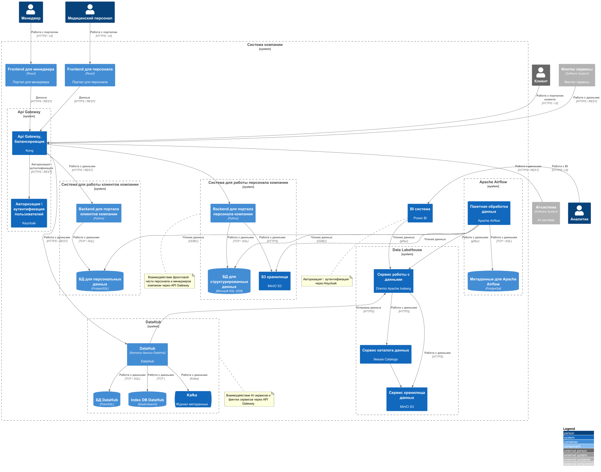

[Архитектура системы через год](container.puml)

# Проблемные места

1. DWH - единая точка отказа системы, т.к. в ней хранятся все данные
2. Использование устаревших технологий: Microsoft SQL 2008, Шина на базе Apache Camel, PowerBuilder
3. Много кастомизаций BI-системы поверх DWH
4. Проблемы безопасности данных, несоблюдение ФЗ-152: данные хранятся в единой БД, без применения политик безопасности

# Приоритизация проблем

## Must:
1. Разделение данных по системам
2. Обновление DWH
3. Деление на домены

## Should:
1. Обновление устаревших технологий: Шина на базе Apache Camel, PowerBuilder
2. Внедрение политики безопасности персональных данных, соблюдение ФЗ-152
3. Перенос исторических данных на обновленный DWH

## Could:
1. Отказ от кастомизаций BI-системы поверх DWH
2. Внедрение единой BI системы

## Won’t:

1. Документация процессов и сервисов системы
2. Перенос AI и Финтех сервисов на работу с DataHub