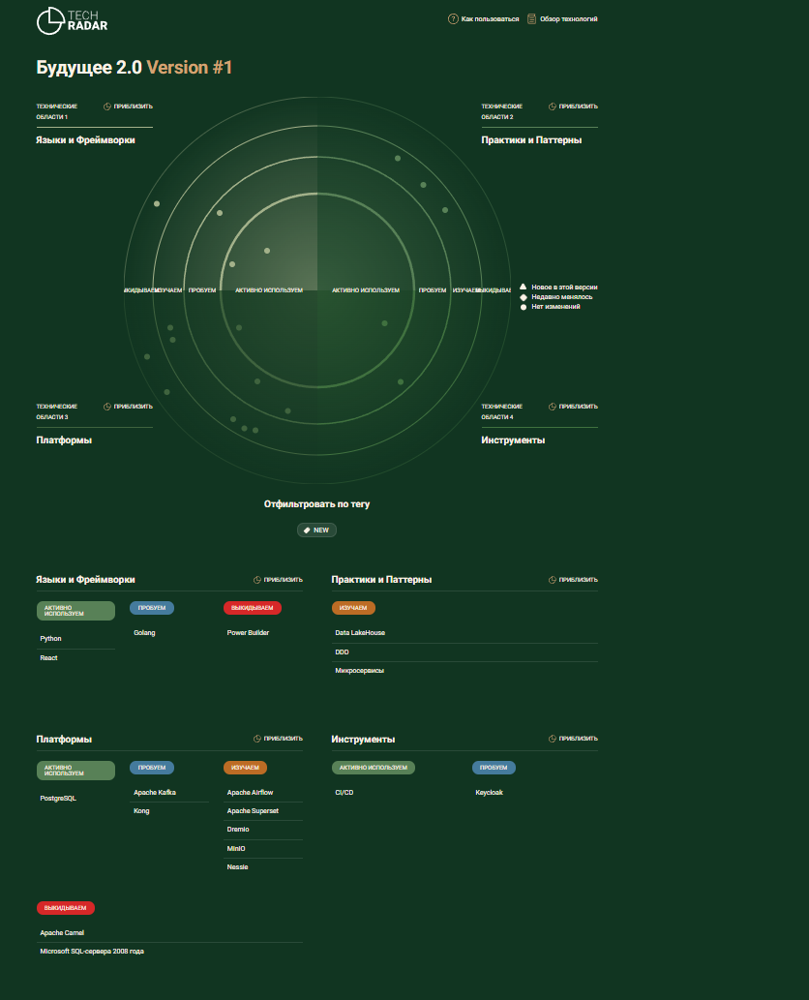

# Технический радар

| Название                         | Квадрант            | Кольцо             |
|----------------------------------|---------------------|--------------------|
| Python                           | Языки и Фреймворки  | Активно используем | 
| React                            | Языки и Фреймворки  | Активно используем | 
| Golang                           | Языки и Фреймворки  | Пробуем            |
| Power Builder                    | Языки и Фреймворки  | Выкидываем         |
| Data LakeHouse                   | Практики и Паттерны | Изучаем            |
| Domain Driven Design             | Практики и Паттерны | Изучаем            |
| Микросервисы                     | Практики и Паттерны | Изучаем            |
| Apache Kafka                     | Платформы           | Пробуем            |
| Apache Superset                  | Платформы           | Пробуем            |
| Kong - API Gateway               | Платформы           | Пробуем            |
| Apache Airflow                   | Платформы           | Изучаем            |
| PostgreSQL                       | Платформы           | Активно используем |
| Dremio                           | Платформы           | Изучаем            |
| MinIO                            | Платформы           | Изучаем            |
| Nessie                           | Платформы           | Изучаем            |
| Apache Camel                     | Платформы           | Выкидываем         |
| Microsoft SQL-сервера 2008 года  | Платформы           | Выкидываем         |
| CI/CD                            | Инструменты         | Активно используем |
| Keycloak                         | Инструменты         | Пробуем            |
| Keycloak                         | Инструменты         | Пробуем            |

